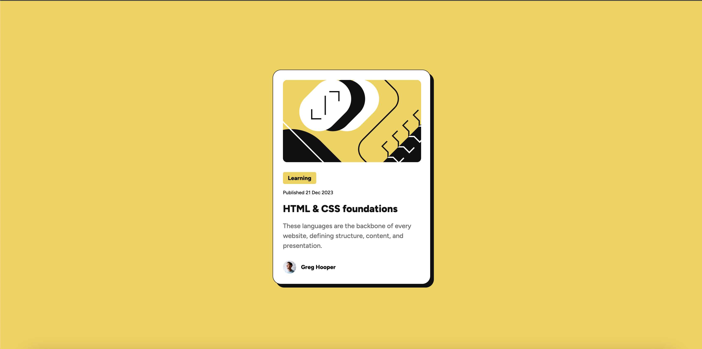

# Frontend Mentor - QR code component

A simple solution for the [Frontend Mentor](https://www.frontendmentor.io) challenge -QR Code Component.

This project was created to practive HTML & CSS following the disign in Figma.

---

## Overview
This project recreates a **Blog Preview Card** from a Figma design, including:  
- Centered card layout  
- Illustration
- Title and description text   
- Mobile-first responsive design  
- Smooth scaling for larger screens (desktop)

---

## Links
- Solution URL: [GitHub Repository](https://github.com/przemekkoczwara/blog-preview-card)  
- Live Site URL: [Your Live Site](https://przemekkoczwara.github.io/blog-preview-card/)  

---

## Built With
- Vite (Vanilla) – only for live reloading, no JavaScript used
- HTML5 & Semantic Markup  
- CSS Variables & Flexbox  
- Mobile-first responsive design  

---

## What I Learned
- How to create simple development inviroment using Vite
- How to implement a **Blog preview card** layout.  
- Using **CSS variables** for colors, typography, and spacing for scalable maintainable design.  
- Apply **Hover** effects to desktop design.
